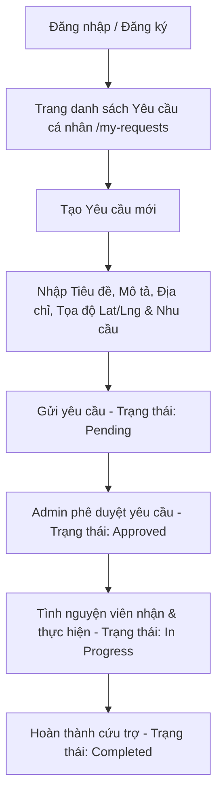
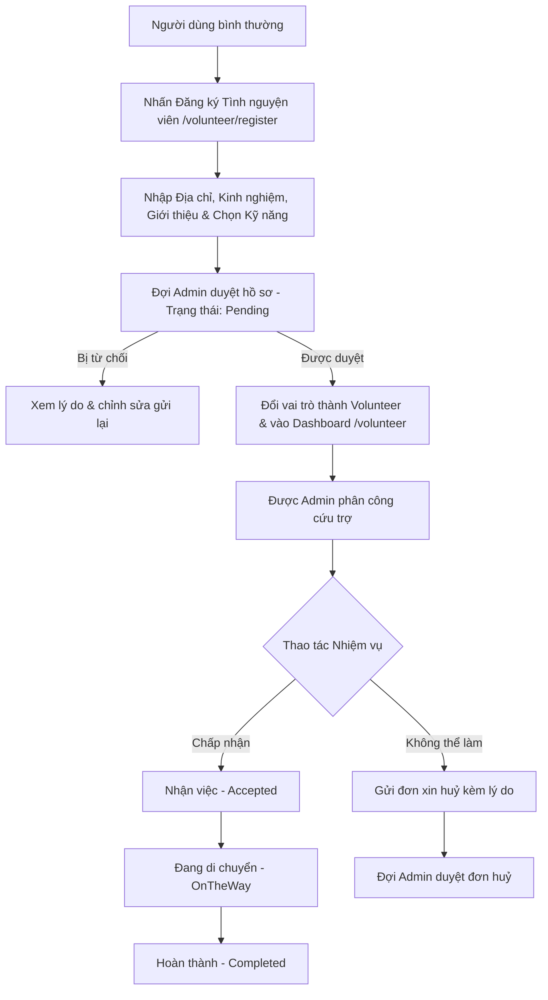
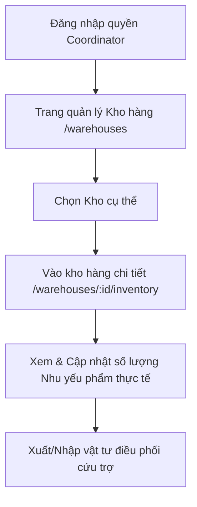
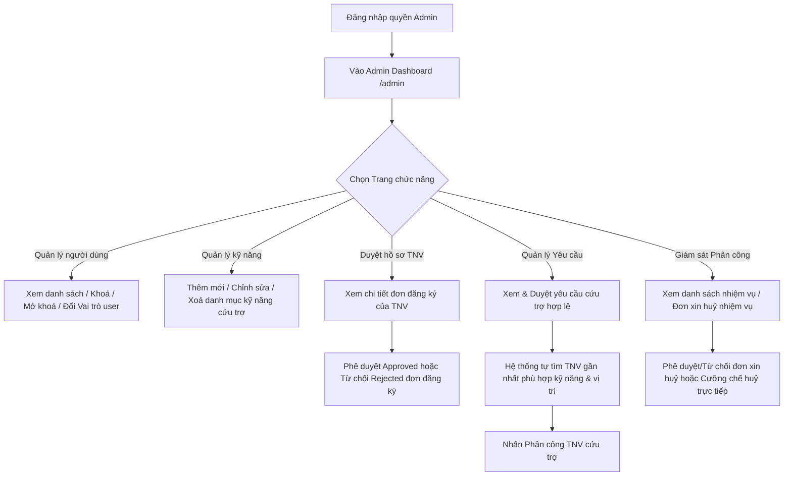

# ReliefConnect – Frontend

Vue 3 + Vite + TypeScript + Pinia + Axios + Element Plus

---

## 📝 Tổng quan dự án

**ReliefConnect** là một nền tảng Web hỗ trợ điều phối cứu trợ thiên tai và quản lý tài nguyên. Hệ thống cho phép kết nối giữa người dân gặp khó khăn (Requesters), tình nguyện viên (Volunteers), các nhà quản lý điều phối kho hàng (Coordinators) và ban quản trị (Admins) nhằm phân phối nhu yếu phẩm và cứu trợ kịp thời, chính xác.

### Các phân hệ chính (Modules):
* **Admin (Quản trị viên)**: Quản lý người dùng, duyệt hồ sơ tình nguyện viên, quản lý danh mục kỹ năng, điều phối phân công nhiệm vụ và theo dõi tổng quan hệ thống qua Dashboard.
* **Coordinator (Quản lý kho)**: Quản lý danh sách kho hàng, xuất/nhập tồn kho vật tư cứu trợ, và cập nhật tình trạng giao nhận vật phẩm.
* **Volunteer (Tình nguyện viên)**: Đăng ký hồ sơ năng lực/kỹ năng, tiếp nhận và báo cáo tiến độ thực hiện các nhiệm vụ cứu trợ được giao.
* **Requester (Người cần hỗ trợ)**: Tạo và theo dõi danh sách các yêu cầu cứu trợ khẩn cấp (nhu cầu về thức ăn, nước uống, thuốc men, y tế...).

---

## Khởi động nhanh

```bash
npm install
npm run dev        # http://localhost:5173
```

## Cấu hình môi trường

Tạo file `.env.local` ở root (không commit):
```env
VITE_API_BASE_URL=https://localhost:7000/api
VITE_APP_TITLE=ReliefConnect
```

---

## Cấu trúc thư mục

```
src/
├── config/
│   └── env.ts               # Typed import.meta.env – single source of truth
├── lib/
│   └── api/
│       ├── http.ts           # Axios instance + interceptors + ApiError
│       └── token-storage.ts  # localStorage token wrapper
├── components/
│   ├── ui/                   # BaseButton, BaseInput, BaseCard, BaseSpinner
│   │   └── index.ts          # Barrel export
│   └── layout/
│       └── AppLayout.vue     # Navbar + logout + <RouterView/>
├── composables/
│   ├── index.ts              # Barrel export
│   ├── useApi.ts             # Generic API call wrapper (loading/error)
│   ├── useConfirm.ts         # Confirm dialog
│   ├── useDebouncedRef.ts    # Debounced reactive ref / search
│   ├── useLocalStorage.ts    # Type-safe reactive localStorage
│   └── usePagination.ts      # Pagination state helpers
├── features/
│   ├── auth/
│   │   ├── auth.api.ts       # loginUser, registerUser, loginWithGoogle
│   │   └── auth.types.ts     # LoginPayload, RegisterPayload, AuthUser, AuthResponse
│   └── users/
│       ├── users.api.ts      # CRUD: get, create, update, delete
│       ├── users.types.ts    # User, CreateUserPayload, PaginatedUsers
│       └── UserFormDialog.vue
├── stores/
│   ├── auth.ts               # Pinia: token, user, isLoggedIn, login(), logout()
│   └── users.ts              # Pinia: users list, pagination, fetch, remove
├── views/
│   ├── HomeView.vue
│   ├── LoginView.vue
│   ├── RegisterView.vue
│   ├── UsersView.vue
│   └── NotFoundView.vue
├── router/
│   └── index.ts              # Lazy routes + auth guard (requiresAuth / guestOnly)
├── App.vue
├── main.ts
└── vite-env.d.ts
```

---

## Quy tắc

| Quy tắc | Mô tả |
|---|---|
| **API calls** | Luôn dùng `src/lib/api/http.ts`, KHÔNG dùng `fetch` hay tạo axios mới |
| **Token** | Chỉ dùng `tokenStorage` từ `lib/api/token-storage.ts` |
| **URL backend** | Chỉ sửa `VITE_API_BASE_URL` trong `.env.local` |
| **Env vars** | Luôn import từ `@/config/env.ts`, không đọc `import.meta.env` trực tiếp |
| **Types** | Định nghĩa interface trong `*.types.ts` của feature tương ứng |
| **State** | Dùng Pinia store, không lưu state phức tạp trong component |

---

## Thêm feature mới

1. Tạo folder `src/features/<tên>/`
2. Thêm `<tên>.types.ts` → interface
3. Thêm `<tên>.api.ts` → gọi `http.get/post/put/delete`
4. Thêm Pinia store vào `src/stores/<tên>.ts`
5. Thêm view vào `src/views/<Tên>View.vue`
6. Đăng ký route trong `src/router/index.ts`

---

## Flow Đăng nhập (Login)

### Sơ đồ tổng quát

```
[User] → /login (guestOnly)
   │
   ├─ Đã đăng nhập? → Redirect /home (Router Guard)
   │
   └─ Chưa đăng nhập → Hiển thị LoginView.vue
         │
         ├─ Nhập email + password → submit form
         │
         ├─ authStore.login(email, password)
         │     │
         │     └─ auth.api.ts: POST /api/auth/login
         │           │
         │           ├─ [Mock mode] → mockLoginUser() (trả data giả)
         │           └─ [Real mode] → axios → http.ts interceptor bóc envelope
         │                 → trả LoginResult { userId, fullName, email, role,
         │                                     accessToken, refreshToken, expiresAt }
         │
         ├─ Lưu vào localStorage:
         │     ├─ auth_access_token  (JWT, hết hạn sau 60 phút)
         │     ├─ auth_refresh_token (hết hạn sau 7 ngày)
         │     └─ auth_user          (AuthUser object, persist qua F5)
         │
         └─ Redirect theo role:
               ├─ Admin        → /admin
               ├─ Volunteer    → /volunteer
               ├─ Requester    → /requester
               ├─ Coordinator  → /warehouses
               └─ Organization → /requester (tạm thời)
```

### Các bước chi tiết

| Bước | File | Mô tả |
|------|------|--------|
| 1. Render form | `views/auth/LoginView.vue` | Input email + password, nút toggle show/hide password |
| 2. Submit | `LoginView.vue` → `handleLogin()` | Validate input không rỗng |
| 3. Gọi store | `stores/auth.ts` → `login()` | Delegate xuống auth.api |
| 4. Gọi API | `features/auth/auth.api.ts` → `loginUser()` | `POST /api/auth/login` với `{ email, password }` |
| 5. Xử lý response | `lib/api/http.ts` interceptor | Bóc envelope `ApiResponse<LoginResult>` → trả `LoginResult` |
| 6. Lưu token | `lib/api/token-storage.ts` | `localStorage`: `auth_access_token`, `auth_refresh_token` |
| 7. Lưu user | `stores/auth.ts` | `localStorage`: `auth_user` (AuthUser object) |
| 8. Redirect | `LoginView.vue` | `router.push()` theo role map |

### Xử lý lỗi

- **Lỗi validation** (input rỗng): thông báo ngay tại client
- **Lỗi API** (sai mật khẩu, không tồn tại): `errorMessages[]` từ BE → hiển thị `error-banner`
- **401 Unauthorized**: http interceptor tự xóa token + redirect `/login`

### Mock Mode

Khi `VITE_USE_MOCK_AUTH=true` trong `.env.local`, hiển thị panel tài khoản test:
- Click vào role → tự điền email/password và đăng nhập ngay
- Danh sách mock accounts định nghĩa trong `src/mocks/auth.mock.ts`

---

## Flow Đăng ký (Register)

### Sơ đồ tổng quát

```
[User] → /register (guestOnly)
   │
   ├─ Đã đăng nhập? → Redirect /home (Router Guard)
   │
   └─ Chưa đăng nhập → Hiển thị RegisterView.vue
         │
         ├─ Nhập: Họ tên, Email, Số điện thoại, Mật khẩu, Xác nhận mật khẩu
         │
         ├─ Client validate: password === confirmPassword
         │
         ├─ Submit → handleRegister()
         │     │
         │     └─ auth.api.ts: POST /api/auth/register
         │           Body: { fullName, email, phoneNumber, password, confirmPassword }
         │           │
         │           ├─ [Mock mode] → mockRegisterUser()
         │           └─ [Real mode] → trả LoginResult (auto-login sau register)
         │
         ├─ BE tạo tài khoản với role mặc định: "Requester"
         │
         ├─ Lưu vào localStorage (giống login):
         │     ├─ auth_access_token
         │     ├─ auth_refresh_token
         │     └─ auth_user
         │
         └─ Redirect → /requester (role mặc định Requester)
```

### Các bước chi tiết

| Bước | File | Mô tả |
|------|------|--------|
| 1. Render form | `views/auth/RegisterView.vue` | Các field: fullName, email, phoneNumber, password, confirmPassword + checkbox đồng ý |
| 2. Validate client | `RegisterView.vue` → `passwordMismatch` computed | So sánh password vs confirmPassword real-time |
| 3. Submit | `RegisterView.vue` → `handleRegister()` | Dừng nếu passwordMismatch |
| 4. Gọi API | `features/auth/auth.api.ts` → `registerUser()` | `POST /api/auth/register` |
| 5. Xử lý response | `http.ts` interceptor | Bóc envelope → trả `LoginResult` (register = auto-login) |
| 6. Lưu token + user | `token-storage.ts` + `auth_user` localStorage | Giống flow login |
| 7. Redirect | `RegisterView.vue` | `router.push('/requester')` (role mặc định) |

### Xử lý lỗi

- **Mật khẩu không khớp**: validate ngay client, không gọi API
- **Email đã tồn tại / validation BE**: `errorMessages[]` → hiển thị `error-banner`
- **phoneNumber bắt buộc**: BE validate "The PhoneNumber field is required" (đã kiểm chứng)

---

## Token & Session Management

| Key localStorage | Giá trị | Thời hạn |
|-----------------|---------|----------|
| `auth_access_token` | JWT Bearer token | 60 phút |
| `auth_refresh_token` | Refresh token | 7 ngày |
| `auth_user` | AuthUser JSON (userId, fullName, email, role, expiresAt) | Persist qua F5 |

### Khởi động lại app (F5)

1. `stores/auth.ts` đọc `auth_access_token` + `auth_user` từ localStorage khi khởi tạo
2. Router Guard kiểm tra `tokenStorage.exists()` để quyết định redirect
3. `fetchMe()` gọi `GET /api/auth/me` để sync thông tin user mới nhất từ BE

### Đăng xuất

1. Gửi `POST /api/auth/logout` với `refreshToken` → BE blacklist token
2. Xóa toàn bộ localStorage: `auth_access_token`, `auth_refresh_token`, `auth_user`
3. `http.ts`: khi nhận 401 → tự động xóa token + redirect `/login`

---

## Role-based Access Control (RBAC)

| Role | Giá trị BE | Quyền mặc định sau login |
|------|-----------|--------------------------|
| `Admin` | `"Admin"` | `/admin` |
| `Volunteer` | `"Volunteer"` | `/volunteer` |
| `Requester` | `"Requester"` | `/requester` (role mặc định khi đăng ký) |
| `Coordinator` | `"Coordinator"` | `/warehouses` (quản lý kho) |
| `Organization` | `"Organization"` | `/requester` (tạm thời) |

Router Guard (`router/index.ts`) kiểm tra 3 điều kiện theo thứ tự:
1. `guestOnly` + đã login → redirect `/home`
2. `requiresAuth` + chưa login → redirect `/login?redirect=<path>`
3. `roles[]` + role không khớp → redirect `/unauthorized`

---

## 🔄 Quy trình nghiệp vụ chính theo Vai trò (Role-based Workflows)

Dưới đây là sơ đồ luồng hoạt động chính của 4 vai trò cốt lõi trong hệ thống:

### 1. Phân hệ Người cần hỗ trợ (Requester Flow)


### 2. Phân hệ Tình nguyện viên (Volunteer Flow)


### 3. Phân hệ Quản lý kho (Coordinator Flow)


### 4. Phân hệ Quản trị viên (Admin Flow)


---

## Cập nhật tính năng & Sửa lỗi mới (Sprint hiện tại)

### 1. Phân luồng đăng ký Tình nguyện viên (Volunteer Registration Flow)
* **Tự động chuyển hướng**: Khi người dùng vào trang đăng ký tình nguyện viên, nếu hồ sơ đã được duyệt (`Approved`), hệ thống tự động đồng bộ vai trò mới và chuyển hướng thẳng sang Volunteer Dashboard (`/volunteer`).
* **Trạng thái chờ duyệt (Pending)**: Giao diện sẽ ẩn Form đăng ký và thay thế bằng thông báo chờ Admin phê duyệt.
* **Trạng thái bị từ chối (Rejected)**: Giao diện sẽ hiển thị thông báo lý do bị từ chối và cho phép người dùng nhấn nút đăng ký lại (Form mở ra trở lại).
* **Tránh trùng lặp hồ sơ**: Tự động lưu trữ thông tin tạm thời ngay tại Frontend khi gửi form để chuyển đổi trạng thái giao diện tức thì, tránh độ trễ ghi-đọc của cơ sở dữ liệu trên cloud gây lỗi gửi trùng lặp `400 Bad Request`.

### 2. Quản lý Tình nguyện viên dành cho Admin
* **Màn hình quản lý**: Thêm màn hình `src/views/admin/VolunteersView.vue` cho phép Admin xem danh sách hồ sơ đăng ký tình nguyện viên (ở trạng thái `Pending` và `Approved`).
* **Xem chi tiết hồ sơ**: Tích hợp hộp thoại chi tiết (`el-dialog`) hiển thị đầy đủ thông tin: Địa chỉ, Tọa độ bản đồ (Lat/Lng), Năm kinh nghiệm, Giới thiệu bản thân và Danh sách các kỹ năng đã đăng ký.
* **Thao tác duyệt/từ chối**: Hỗ trợ nút Phê duyệt (`Approve`) hoặc Từ chối (`Reject`) trực tiếp tại bảng danh sách hoặc trong hộp thoại chi tiết.

### 3. Tối ưu hóa trang Quản lý người dùng (`/users`)
* **Sửa lỗi phân trang**: Loại bỏ composable `usePagination` hoạt động độc lập không đồng bộ, thay thế bằng các thuộc tính computed liên kết trực tiếp với Pinia store (`store.total`, `store.page`, `store.pageSize`), sửa triệt để lỗi nút "Trước"/"Tiếp" bị vô hiệu hóa.
* **Tìm kiếm tiếng Việt không dấu (Accent-insensitive)**: Tích hợp bộ lọc chuẩn hóa tiếng Việt giúp Admin tìm kiếm người dùng case-insensitive và accent-insensitive (ví dụ: gõ `"dat"` vẫn tìm được `"đạt09"`).
* **Tự động đồng bộ URL (F5 preservation)**: Đồng bộ hai chiều bộ lọc vai trò, số trang và từ khóa tìm kiếm lên tham số URL (Query params). Khi nhấn F5 để tải lại trang, toàn bộ bộ lọc và trang hiện tại sẽ được tự động khôi phục.
* **Tự động mở rộng vùng tìm kiếm**: Khi có từ khóa tìm kiếm, Frontend tự động nâng tạm thời `pageSize` lên tối đa `100` bản ghi để tối ưu hóa phạm vi quét dữ liệu cục bộ trong giới hạn tải của Backend.

### 4. Đồng bộ hóa Dashboard hệ thống (`/admin`)
* **Sửa lỗi hiển thị count**: Cập nhật lại cơ chế tính tổng số lượng thống kê (Người dùng, Yêu cầu cứu trợ, Tình nguyện viên) bằng cách cộng dồn các bản ghi được trả về theo dạng phân loại từ API `/api/dashboard/summary`.
* **Tổng số kho hàng**: Tích hợp thêm API gọi `getAllWarehouses()` để hiển thị chính xác tổng số kho hàng thực tế đang hoạt động trong hệ thống.

---

## ✨ Các điểm nổi bật về Frontend (FE Key Highlights)

Dành cho các thành viên phát triển Frontend (FE Members) nắm bắt nhanh các giải pháp công nghệ đã triển khai:

### 1. Đa ngôn ngữ toàn diện & Phản hồi thời gian thực (`vue-i18n`)
- **Tích hợp sâu**: Hỗ trợ chuyển đổi ngôn ngữ Việt / Anh tức thì cho toàn bộ các nhãn điều hướng, tiêu đề trang, bộ lọc, bảng dữ liệu, huy hiệu trạng thái, và các hộp thoại (`el-dialog`).
- **Dynamic Chart & Map**: Bản đồ Leaflet Popups và Trục đồ thị SVG tự vẽ đều phản hồi reactive theo sự thay đổi của biến `locale.value` mà không cần tải lại trang.

### 2. Trải nghiệm người dùng hiện đại & Thiết kế Card tách biệt
- **System Distribution (Phân bổ hệ thống)**: Được thiết kế lại thành một Card độc lập tách rời khỏi bảng Quick Actions, chuyển từ biểu đồ cột dọc bị chèn ép sang dạng danh sách các thanh tiến trình ngang (`Horizontal Progress Bars`) trực quan, hiển thị rõ số liệu và phần trăm thực tế của từng tài nguyên.
- **Micro-animations**: Áp dụng hiệu ứng hover chuyển động mượt mà cho các Quick Action Buttons và Stat Cards.

### 3. Tích hợp bản đồ Leaflet (OpenStreetMap)
- **Dashboard Map Panel**: Sử dụng thư viện Leaflet để vẽ bản đồ phân bổ địa lý. Trực quan hóa các Yêu cầu cứu trợ dưới dạng Circle Markers có bán kính và màu sắc tương ứng theo cấp độ khẩn cấp (`Emergency Level`), và các Kho hàng dưới dạng Custom Div Icons riêng biệt.
- **Tự động căn chỉnh (fitBounds)**: Bản đồ tự tính toán vùng hiển thị bao phủ toàn bộ các điểm ghim hiện có để người dùng không cần zoom thủ công.

### 4. Biểu đồ trực quan tự vẽ (SVG Charts)
- **RequestsOverTimeChart**: Sử dụng thẻ SVG thuần để dựng biểu đồ vùng và đường xu hướng, loại bỏ sự phụ thuộc vào các thư viện chart cồng kềnh giúp tối ưu tốc độ tải.
- **Interactive Tooltip**: Hỗ trợ rê chuột (Pointer Hover) xác định tọa độ động, hiển thị thông tin số lượng yêu cầu theo từng mốc ngày cụ thể kèm hiệu ứng crosshair thông minh.

### 5. URL Query State Preservation (F5 Preservation)
- Đồng bộ bộ lọc tìm kiếm, số trang phân trang, bộ lọc vai trò lên URL query parameters, giúp giữ nguyên trạng thái làm việc khi người dùng F5 tải lại trang.
- Tìm kiếm tiếng Việt không dấu tự động chuẩn hóa (`accent-insensitive` & `case-insensitive`) tối ưu trải nghiệm tra cứu dữ liệu.