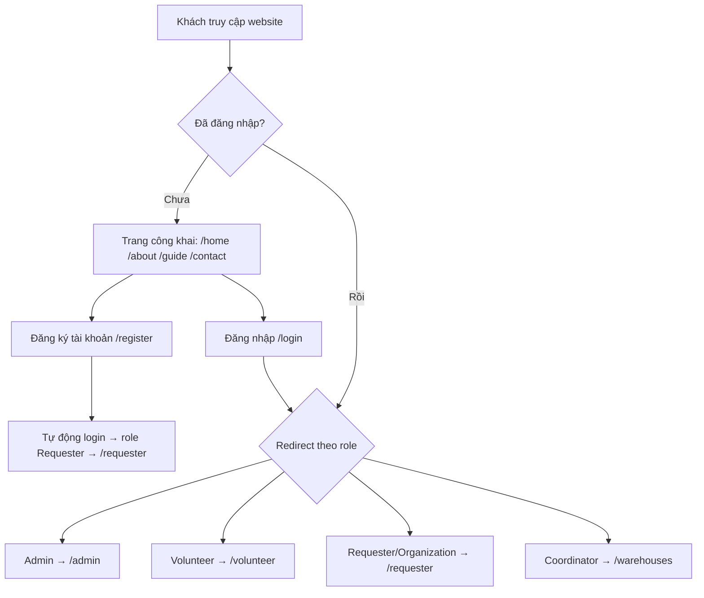
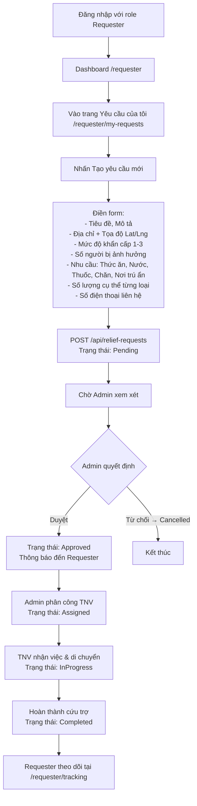
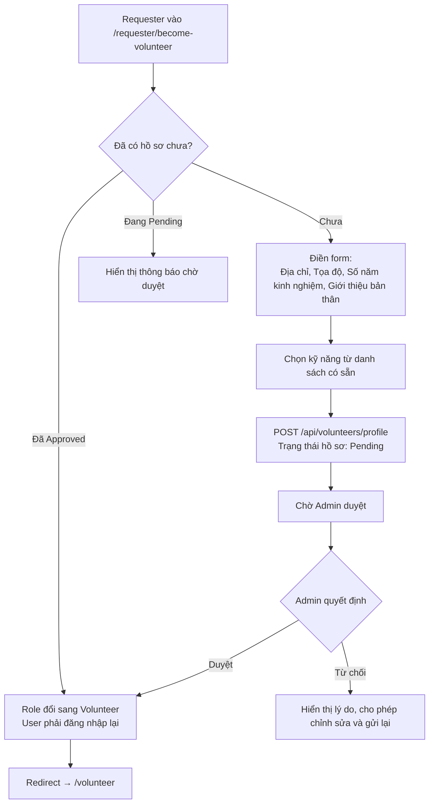
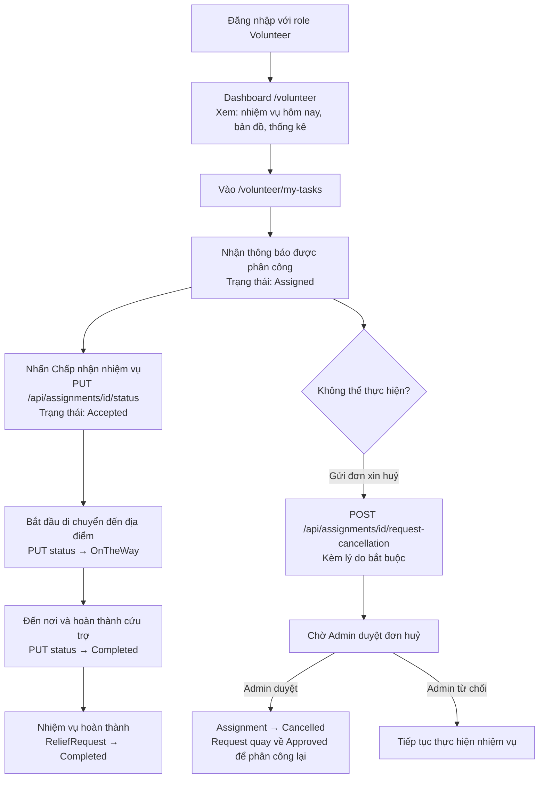
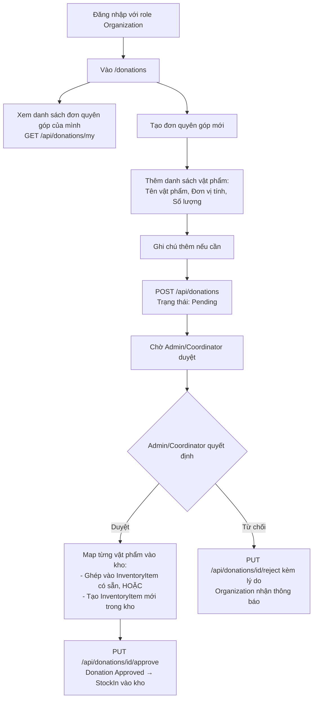
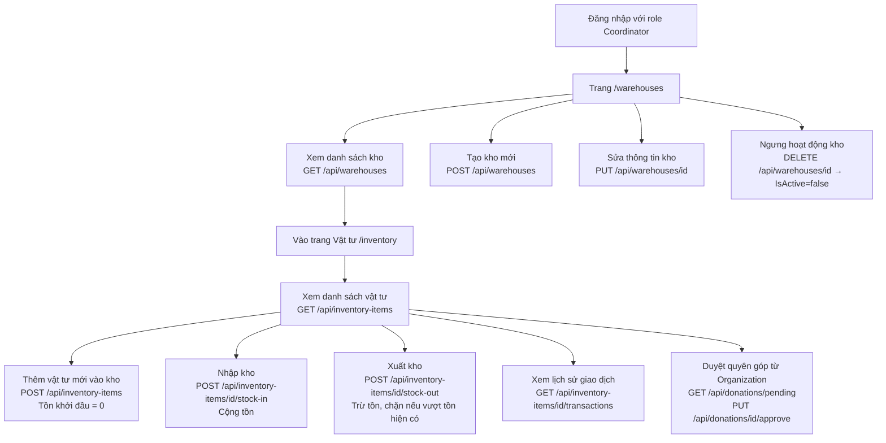
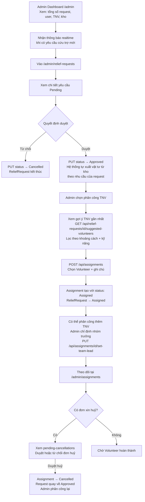
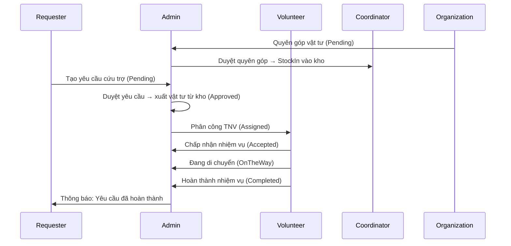

# ReliefConnect – Frontend

> **Tech Stack**: Vue 3 · Vite · TypeScript · Pinia · Axios · Element Plus · vue-i18n · Leaflet

---

## 📌 Mục lục

1. [Tổng quan dự án](#1-tổng-quan-dự-án)
2. [Các vai trò trong hệ thống](#2-các-vai-trò-trong-hệ-thống)
3. [Khởi động nhanh](#3-khởi-động-nhanh)
4. [Cấu trúc thư mục](#4-cấu-trúc-thư-mục)
5. [Xác thực & Phiên làm việc](#5-xác-thực--phiên-làm-việc)
6. [Flow theo từng vai trò](#6-flow-theo-từng-vai-trò)
   - [6.1 Khách (Guest)](#61-flow-khách-guest)
   - [6.2 Requester – Người cần hỗ trợ](#62-flow-requester--người-cần-hỗ-trợ)
   - [6.3 Volunteer – Tình nguyện viên](#63-flow-volunteer--tình-nguyện-viên)
   - [6.4 Organization – Tổ chức quyên góp](#64-flow-organization--tổ-chức-quyên-góp)
   - [6.5 Coordinator – Quản lý kho](#65-flow-coordinator--quản-lý-kho)
   - [6.6 Admin – Quản trị viên](#66-flow-admin--quản-trị-viên)
7. [Luồng nghiệp vụ xuyên suốt](#7-luồng-nghiệp-vụ-xuyên-suốt)
8. [State machine trạng thái](#8-state-machine-trạng-thái)
9. [Route & RBAC Guard](#9-route--rbac-guard)
10. [Quy tắc phát triển](#10-quy-tắc-phát-triển)

---

## 1. Tổng quan dự án

**ReliefConnect** là nền tảng web điều phối cứu trợ thiên tai. Hệ thống kết nối **người dân gặp khó khăn**, **tình nguyện viên**, **tổ chức quyên góp**, **quản lý kho** và **ban quản trị** để phân phối nhu yếu phẩm (thức ăn, nước, thuốc, chăn, nơi trú ẩn) nhanh chóng và chính xác.

**Backend**: `https://disasterrelief-api.runasp.net`  
**Mọi response** đều bọc trong `ApiResponse<T>` (trừ 3 API xuất Excel).

---

## 2. Các vai trò trong hệ thống

| Role | Tên hiển thị | Quyền ưu tiên | Trang mặc định sau login |
|---|---|:---:|---|
| `Admin` | Quản trị viên | 5 (cao nhất) | `/admin` |
| `Coordinator` | Quản lý kho | 4 | `/warehouses` |
| `Organization` | Tổ chức | 3 | `/requester` |
| `Volunteer` | Tình nguyện viên | 2 | `/volunteer` |
| `Requester` | Người yêu cầu hỗ trợ | 1 | `/requester` |

> **Ghi chú**: Mọi tài khoản mới đăng ký đều nhận role `Requester` mặc định.  
> Muốn nâng lên `Volunteer` → đăng ký hồ sơ TNV, Admin duyệt.  
> Muốn nâng lên `Organization`/`Coordinator` → gửi nguyện vọng nâng quyền, Admin duyệt.

---

## 3. Khởi động nhanh

```bash
npm install
npm run dev        # http://localhost:5173
```

### Cấu hình môi trường

Tạo file `.env.local` ở root (không commit):
```env
VITE_API_BASE_URL=https://disasterrelief-api.runasp.net/api
VITE_APP_TITLE=ReliefConnect
```

### Tài khoản seed để test

| Email | Password | Role |
|---|---|---|
| `admin@relief.vn` | `Admin@123` | Admin |

Tạo thêm tài khoản: `POST /api/auth/register` → role mặc định `Requester` → Admin đổi role qua `PUT /api/admin/users/{id}/role`.

---

## 4. Cấu trúc thư mục

```
src/
├── config/            # env.ts — typed import.meta.env
├── lib/api/
│   ├── http.ts        # Axios instance + interceptors + auto token refresh
│   └── token-storage.ts
├── components/
│   ├── ui/            # BaseButton, BaseInput, BaseCard, BaseSpinner...
│   └── layout/
│       └── AppLayout.vue   # Navbar + sidebar + <RouterView/>
├── composables/       # useApi, useConfirm, usePagination, useLocalStorage...
├── features/          # Mỗi domain: *.types.ts + *.api.ts
│   ├── auth/
│   ├── requests/
│   ├── tasks/         # assignments.api.ts + tasks.api.ts
│   ├── volunteers/
│   ├── donations/
│   ├── inventory/
│   ├── warehouses/
│   ├── role-requests/
│   ├── reports/
│   └── notifications/
├── stores/
│   ├── auth.ts        # Pinia: token, user, role, login/logout/fetchMe
│   └── users.ts
├── views/
│   ├── shared/        # HomeView, AboutView, GuideView, ContactView, ProfileView
│   ├── auth/          # LoginView, RegisterView, ForgotPassword, ResetPassword
│   ├── requester/     # RequesterDashboard, MyRequestsView, TrackingView...
│   ├── volunteer/     # VolunteerDashboard, MyTasksView, OpenTasksView...
│   ├── admin/         # AdminDashboard, UsersView, ReliefRequestsView...
│   ├── donations/     # MyDonationsView
│   ├── inventory/     # InventoryView
│   └── Warehouses/    # WarehousesView
├── router/index.ts    # Lazy routes + RBAC Guard
├── i18n.ts            # vue-i18n (vi / en)
└── main.ts
```

---

## 5. Xác thực & Phiên làm việc

### Luồng đăng nhập

```
[User] → POST /api/auth/login { email, password }
           ↓
    accessToken (JWT, 60 phút) + refreshToken (7 ngày)
           ↓
    localStorage: auth_access_token, auth_refresh_token, auth_user
           ↓
    Redirect theo role → /admin | /volunteer | /requester | /warehouses
```

### Luồng đăng ký

```
[Guest] → POST /api/auth/register → role mặc định: Requester → auto-login → /requester
```

### Quên mật khẩu (3 bước)

```
1. /forgot-password  → POST /api/auth/forgot-password { email } → gửi mã 6 số qua email
2. /verify-reset-code → POST /api/auth/verify-reset-code { email, code } → nhận resetSessionId
3. /reset-password   → POST /api/auth/reset-password { resetSessionId, newPassword }
```

### Token Management

| Key localStorage | Nội dung | Hết hạn |
|---|---|---|
| `auth_access_token` | JWT Bearer | 60 phút |
| `auth_refresh_token` | Refresh token | 7 ngày |
| `auth_user` | `{ userId, fullName, email, role, expiresAt }` | Persist qua F5 |

**Auto-refresh**: Khi `accessToken` hết hạn (nhận 401), `http.ts` interceptor tự gọi `POST /api/auth/refresh-token`, lấy token mới và retry request gốc — **người dùng không cảm nhận được gián đoạn**.

### Đăng xuất

```
POST /api/auth/logout { refreshToken }   → BE blacklist token
→ Xóa toàn bộ localStorage → redirect /login
```

---

## 6. Flow theo từng vai trò

---

### 6.1 Flow Khách (Guest)

Khách chưa đăng nhập chỉ truy cập được trang **công khai**:

| Trang | URL | Mô tả |
|---|---|---|
| Trang chủ | `/home` | Giới thiệu nền tảng |
| Giới thiệu | `/about` | Về ReliefConnect |
| Hướng dẫn | `/guide` | Cách sử dụng |
| Liên hệ | `/contact` | Thông tin liên hệ |
| Đăng nhập | `/login` | Form đăng nhập |
| Đăng ký | `/register` | Tạo tài khoản mới |



---

### 6.2 Flow Requester – Người cần hỗ trợ

**Requester** là người dân/cá nhân cần hỗ trợ khẩn cấp khi xảy ra thiên tai.

#### Các trang truy cập được

| Trang | URL | Mô tả |
|---|---|---|
| Dashboard | `/requester` | Tổng quan: số yêu cầu, trạng thái |
| Yêu cầu của tôi | `/requester/my-requests` | Danh sách & tạo yêu cầu cứu trợ |
| Theo dõi hỗ trợ | `/requester/tracking` | Xem tiến độ từng yêu cầu |
| Thông báo | `/requester/notifications` | Các thông báo liên quan |
| Hướng dẫn | `/requester/guide` | Hướng dẫn sử dụng cho Requester |
| Đăng ký TNV | `/requester/become-volunteer` | Nâng cấp trở thành Tình nguyện viên |

#### Luồng tạo & theo dõi yêu cầu cứu trợ



#### Trạng thái yêu cầu cứu trợ (ReliefRequest)

| Trạng thái | Ý nghĩa hiển thị | Màu |
|---|---|---|
| `Pending` | Đang xử lý | 🟡 Vàng |
| `Approved` | Đang xử lý (đã duyệt vật tư) | 🟢 Xanh ngọc |
| `Assigned` | Đã tiếp nhận (đã có TNV) | 🔵 Xanh dương |
| `InProgress` | Đã tiếp nhận (TNV đang đến) | 🟣 Tím |
| `Completed` | Đã hoàn thành | 🟩 Xanh lá |
| `Cancelled` | Đã hủy | ⚫ Xám |

#### Đăng ký trở thành Tình nguyện viên



---

### 6.3 Flow Volunteer – Tình nguyện viên

**Volunteer** là người được Admin duyệt hồ sơ và phân công đi thực hiện cứu trợ thực địa.

#### Các trang truy cập được

| Trang | URL | Mô tả |
|---|---|---|
| Dashboard | `/volunteer` | Tổng quan: nhiệm vụ đang có, lịch, bản đồ |
| Nhiệm vụ của tôi | `/volunteer/my-tasks` | Danh sách nhiệm vụ được phân công |
| Bảng nhiệm vụ mở | `/volunteer/open-tasks` | Xem tất cả nhiệm vụ đang mở |
| Lịch sử hoạt động | `/volunteer/history` | Các nhiệm vụ đã hoàn thành |
| Kỹ năng | `/volunteer/skills` | Thêm/xóa kỹ năng của bản thân |
| Thông báo | `/volunteer/notifications` | Thông báo về nhiệm vụ mới |
| Hồ sơ cá nhân | `/volunteer/profile` | Xem và cập nhật hồ sơ TNV |

#### Luồng thực hiện nhiệm vụ



#### Vòng đời trạng thái Assignment (Volunteer cập nhật)

```
Assigned → Accepted → OnTheWay → Completed
              ↓ (nếu muốn huỷ)
         request-cancellation (Pending) → Admin Approve → Cancelled
                                        → Admin Reject  → tiếp tục
```

#### Quản lý kỹ năng

```
/volunteer/skills
   ↓
GET /api/skills         → Danh sách tất cả kỹ năng hệ thống
GET /api/volunteers/me  → Kỹ năng hiện có của Volunteer
   ↓
Thêm: POST /api/volunteers/skills { skillIds: [...] }
Xóa:  DELETE /api/volunteers/skills/{skillId}
```

---

### 6.4 Flow Organization – Tổ chức quyên góp

**Organization** là các tổ chức/doanh nghiệp muốn quyên góp vật tư vào kho cứu trợ.

#### Các trang truy cập được

| Trang | URL | Mô tả |
|---|---|---|
| Dashboard | `/requester` | Tổng quan (dùng chung với Requester) |
| Quyên góp vật tư | `/donations` | Tạo và theo dõi đơn quyên góp |
| Thông báo | `/requester/notifications` | Thông báo về trạng thái quyên góp |

> Organization cũng có thể tạo yêu cầu cứu trợ như Requester.

#### Luồng quyên góp vật tư



---

### 6.5 Flow Coordinator – Quản lý kho

**Coordinator** quản lý kho vật tư cứu trợ: nhập kho, xuất kho, theo dõi tồn kho.

#### Các trang truy cập được

| Trang | URL | Mô tả |
|---|---|---|
| Quản lý kho | `/warehouses` | Danh sách kho, tạo/sửa kho |
| Vật tư & tồn kho | `/inventory` | Quản lý vật tư từng kho |

#### Luồng quản lý kho & vật tư



#### Cảnh báo tồn kho thấp

Mỗi `InventoryItem` có trường `minimumQuantity`. Khi `quantity ≤ minimumQuantity`, trường `isLowStock = true` → giao diện hiển thị cảnh báo màu đỏ.

---

### 6.6 Flow Admin – Quản trị viên

**Admin** có toàn quyền trên hệ thống: quản lý người dùng, duyệt mọi thứ, phân công TNV, xem báo cáo.

#### Các trang truy cập được (Admin only)

| Trang | URL | Mô tả |
|---|---|---|
| Dashboard | `/admin` | Tổng quan hệ thống + bản đồ + biểu đồ |
| Quản lý người dùng | `/users` | CRUD user, khóa/mở khóa, đổi role |
| Quản lý yêu cầu | `/admin/relief-requests` | Duyệt yêu cầu cứu trợ, phân công TNV |
| Quản lý phân công | `/admin/assignments` | Giám sát tất cả assignment |
| Duyệt hồ sơ TNV | `/admin/volunteers` | Duyệt/từ chối hồ sơ Volunteer |
| Duyệt quyên góp | `/admin/donations` | Duyệt/từ chối đơn quyên góp |
| Duyệt nâng quyền | `/admin/role-requests` | Duyệt nguyện vọng đổi role |
| Quản lý kỹ năng | `/admin/skills` | CRUD danh mục kỹ năng |
| Báo cáo | `/admin/reports` | Xuất Excel: Yêu cầu, Phân công, Tồn kho |
| Quản lý kho | `/warehouses` | (chia sẻ với Coordinator) |
| Vật tư tồn kho | `/inventory` | (chia sẻ với Coordinator) |

#### Luồng duyệt & điều phối cứu trợ (nghiệp vụ cốt lõi)



#### Luồng quản lý người dùng

```mermaid
graph TD
    A[/users - Danh sách người dùng] --> B[Tìm kiếm theo tên/email\nLọc theo role và trạng thái]
    B --> C{Thao tác}
    C -- Khóa tài khoản --> D[PUT /api/admin/users/id/deactivate]
    C -- Mở khóa --> E[PUT /api/admin/users/id/activate]
    C -- Đổi role --> F[PUT /api/admin/users/id/role\n VD: đổi Requester → Organization\nUser phải login lại]
```

#### Luồng duyệt hồ sơ Volunteer

```mermaid
graph TD
    A[/admin/volunteers\nDanh sách hồ sơ Pending] --> B[Xem chi tiết:\nĐịa chỉ, Tọa độ, Kinh nghiệm, Kỹ năng, Bio]
    B --> C{Quyết định}
    C -- Duyệt --> D[PUT /api/admin/volunteers/id/approve\nRole User đổi sang Volunteer\nHồ sơ: Approved]
    C -- Từ chối --> E[PUT /api/admin/volunteers/id/reject\nHồ sơ: Rejected\nUser nhận thông báo lý do]
```

#### Luồng duyệt nguyện vọng nâng quyền

```mermaid
graph TD
    A[/admin/role-requests\nDanh sách nguyện vọng Pending] --> B[Xem: User hiện tại, Role muốn lên, Lý do]
    B --> C{Quyết định}
    C -- Duyệt --> D[PUT /api/admin/role-requests/id/approve\nRole User đổi ngay lập tức\nUser phải login lại]
    C -- Từ chối --> E[PUT /api/admin/role-requests/id/reject\nKèm ghi chú lý do bắt buộc]
```

#### Báo cáo & Xuất dữ liệu

```
/admin/reports
├── Xuất Excel Yêu cầu cứu trợ   → GET /api/reports/relief-requests/excel
├── Xuất Excel Phân công TNV       → GET /api/reports/assignments/excel
└── Xuất Excel Tồn kho             → GET /api/reports/inventory/excel (2 sheets)
```

> ⚠️ 3 API này trả file `.xlsx` thô — không bọc `ApiResponse`, FE xử lý dạng blob download.

#### Dashboard Admin (các widget)

| Widget | API | Mô tả |
|---|---|---|
| Số liệu tổng quan | `GET /api/dashboard/summary` | Số request theo trạng thái, số user theo role |
| Biểu đồ theo thời gian | `GET /api/dashboard/requests-over-time` | Xu hướng yêu cầu theo ngày (SVG chart) |
| Bản đồ | `GET /api/dashboard/map` | Vị trí các request + kho (Leaflet) |

---

## 7. Luồng nghiệp vụ xuyên suốt

Đây là luồng hoàn chỉnh từ khi có thiên tai đến khi hoàn thành cứu trợ, liên kết tất cả các vai trò:



---

## 8. State machine trạng thái

### ReliefRequest Status

```
Pending ──[Admin Approve]──→ Approved ──[Admin Assign TNV]──→ Assigned
                                ↑                                    ↓
                         (TNV Cancel,                    [TNV Accept]
                          reassign)                           ↓
                                                         InProgress
                                                              ↓
                                                         [TNV Complete]
                                                              ↓
                                                          Completed

Pending / Approved / Assigned / InProgress ──[Admin/Requester]──→ Cancelled
```

### Assignment Status (Volunteer cập nhật)

```
Assigned ──[Accept]──→ Accepted ──[Di chuyển]──→ OnTheWay ──[Hoàn thành]──→ Completed
    │                      │
    └──[Request Cancel]─→ (Pending Cancel) ──[Admin Approve]──→ Cancelled
                                           ──[Admin Reject]──→ tiếp tục
```

### Volunteer Profile Status

```
(Không có) ──[Requester gửi đơn]──→ Pending ──[Admin Approve]──→ Approved
                                           └──[Admin Reject]──→ Rejected ──[Gửi lại]──→ Pending
```

### Donation Status

```
Pending ──[Admin/Coordinator Approve + Map vào kho]──→ Approved
        └──[Admin/Coordinator Reject + Lý do]──→ Rejected
```

### Role Request Status

```
Pending ──[Admin Approve]──→ Approved (user đổi role ngay, phải login lại)
        └──[Admin Reject + Ghi chú]──→ Rejected
```

---

## 9. Route & RBAC Guard

Router Guard (`src/router/index.ts`) kiểm tra **3 lớp theo thứ tự**:

```typescript
// 1. guestOnly + đã login → redirect /home
if (to.meta.guestOnly && isLoggedIn) return { name: 'home' }

// 2. requiresAuth + chưa login → redirect /login?redirect=<path>
if (to.meta.requiresAuth && !isLoggedIn) return { name: 'login', query: { redirect: to.fullPath } }

// 3. roles[] + role không khớp → redirect /unauthorized
if (to.meta.roles && !to.meta.roles.includes(userRole)) return { name: 'unauthorized' }
```

### Bảng quyền truy cập các route

| URL | Requester | Volunteer | Organization | Coordinator | Admin |
|---|:---:|:---:|:---:|:---:|:---:|
| `/home`, `/about`, `/guide`, `/contact` | ✅ | ✅ | ✅ | ✅ | ✅ |
| `/profile` | ✅ | ✅ | ✅ | ✅ | ✅ |
| `/requester/*` | ✅ | ❌ | ✅ | ❌ | ✅ |
| `/requester/become-volunteer` | ✅ | ❌ | ❌ | ❌ | ✅ |
| `/donations` | ❌ | ❌ | ✅ | ❌ | ✅ |
| `/volunteer/*` | ❌ | ✅ | ❌ | ❌ | ✅ |
| `/warehouses`, `/inventory` | ❌ | ❌ | ❌ | ✅ (ghi) | ✅ |
| `/coordinator` | ❌ | ❌ | ❌ | ❌ | ✅ |
| `/admin`, `/users`, `/admin/*` | ❌ | ❌ | ❌ | ❌ | ✅ |

> Kho (`/warehouses`, `/inventory`) mọi role đã login đều **đọc được** (xem danh sách/tồn kho). Ghi (tạo/sửa/stock-in/stock-out) bị BE chặn 403 nếu không phải Admin/Coordinator.

---

## 10. Quy tắc phát triển

| Quy tắc | Mô tả |
|---|---|
| **API calls** | Luôn dùng `src/lib/api/http.ts`, KHÔNG dùng `fetch` hay tạo axios mới |
| **Token** | Chỉ dùng `tokenStorage` từ `lib/api/token-storage.ts` |
| **Env vars** | Luôn import từ `@/config/env.ts`, không đọc `import.meta.env` trực tiếp |
| **Types** | Định nghĩa interface trong `*.types.ts` của feature tương ứng |
| **State** | Dùng Pinia store, không lưu state phức tạp trong component |
| **URL backend** | Chỉ sửa `VITE_API_BASE_URL` trong `.env.local` |
| **Error handling** | Kiểm tra `response.status` trước `JSON.parse()` — 401/403 có thể không có body |

### Thêm feature mới

1. Tạo folder `src/features/<tên>/`
2. Thêm `<tên>.types.ts` → interface
3. Thêm `<tên>.api.ts` → gọi `http.get/post/put/delete`
4. Thêm Pinia store vào `src/stores/<tên>.ts` (nếu cần)
5. Thêm view vào `src/views/<RoleName>/<TênView>.vue`
6. Đăng ký route trong `src/router/index.ts` với `meta.roles` phù hợp

### Realtime (SignalR)

Hub: `https://disasterrelief-api.runasp.net/hubs/notifications`

| Event | Đối tượng nhận | Khi nào |
|---|---|---|
| `ReceiveNotification` | User cụ thể | Có thông báo mới cho user đó |
| `NewReliefRequest` | Admin (broadcast) | Có yêu cầu cứu trợ mới được tạo |
| `NewCancellationRequest` | Admin (broadcast) | Có đơn xin huỷ assignment mới |

---

*Tài liệu API chi tiết: xem [`API-Reference-FE.md`](./API-Reference-FE.md)*